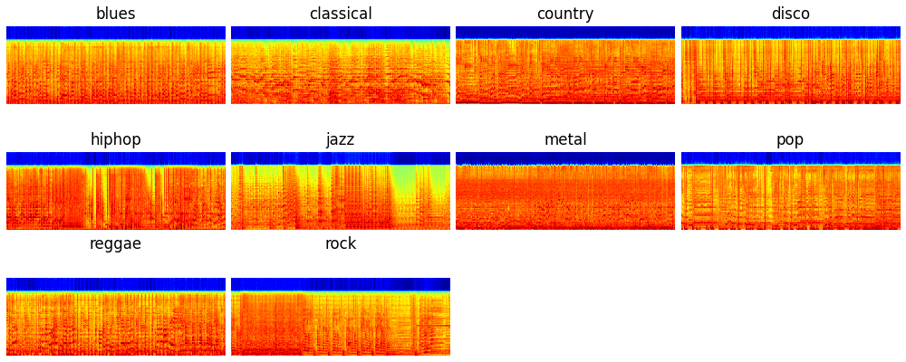
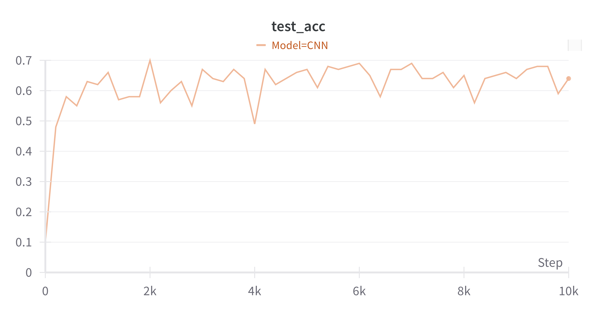

# A Minimal Implementation of Music tagging

This is an example of building a music tagging system with neural networks. We use the GTZAN dataset containing 1,000 30-second audio clips for training and validation. The GTZAN dataset contains 10 genres. We use 900 audio files for training and use 100 audio files for validation. Here are the log mel spectrograms of different genre audios.



The original link dataset link: [http://marsyas.info/index.html](http://marsyas.info/index.html) is not available anymore. Please search other sources to download the dataset. The downloaded dataset looks like:

<pre>
dataset_root (1.3 GB)
└── genres
    ├── blues (100 files)
    ├── classical (100 files)
    ├── country (100 files)
    ├── disco (100 files)
    ├── hiphop (100 files)
    ├── jazz (100 files)
    ├── metal (100 files)
    ├── pop (100 files)
    ├── reggae (100 files)
    └── rock (100 files)
</pre>

# 0. Install dependencies

```bash
git clone https://github.com/qiuqiangkong/mini_music_tagging

# Install Python environment.
conda create --name music_tagging python=3.8

# Activate environment.
conda activate music_tagging

# Install Python packages dependencies.
sh env.sh
```

# 1. Single GPU training.

We use the Wandb toolkit for logging. You may set wandb_log to False or use other loggers.

```python
CUDA_VISIBLE_DEVICES=0 python train.py
```

# Multiple GPUs training.

We use Huggingface accelerate toolkit for multiple GPUs training. Here is an example of using 4 GPUs for training.

```python
CUDA_VISIBLE_DEVICES=0,1,2,3 accelerate launch --multi_gpu --num_processes 4 train_accelerate.py
```

The training looks like:

<pre>
0it [00:00, ?it/s]step: 0, loss: 0.865           
Accuracy: 0.1                                 
Save model to checkpoints/train/Cnn/step=0.pth   
Save model to checkpoints/train/Cnn/latest.pth
200it [00:31,  7.80it/s]step: 200, loss: 0.159   
Accuracy: 0.48                                
Save model to checkpoints/train/Cnn/step=200.pth 
Save model to checkpoints/train/Cnn/latest.pth
...
Accuracy: 0.64
Save model to checkpoints/train/Cnn/step=10000.pth
Save model to checkpoints/train/Cnn/latest.pth
</pre>

The validation accuracy during training looks like:



# 2. Inference

Users may use the trained checkpoints for inference. F

```python
CUDA_VISIBLE_DEVICES=0 python inference.py
```

or example, we test on fold 0 and get the following results:

<pre>
Accuracy: 0.670
</pre>

# Reference

```
@article{kong2020panns,
  title={Panns: Large-scale pretrained audio neural networks for audio pattern recognition},
  author={Kong, Qiuqiang and Cao, Yin and Iqbal, Turab and Wang, Yuxuan and Wang, Wenwu and Plumbley, Mark D},
  journal={IEEE/ACM Transactions on Audio, Speech, and Language Processing},
  volume={28},
  pages={2880--2894},
  year={2020},
}
```